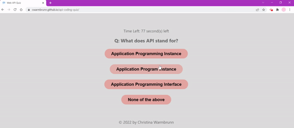

## Web APIs Coding Quiz

**Project Description/Summary:**

Building a responsive site that allows users to take timed quizzes to test their Web API knowledge. Once all answers are completed, or the timer runs to zero, the user will be able to save their high score and initials.

---

**Live Site:**

Head over to https://cwarmbrunn.github.io/api-coding-quiz/ to view the page live!

---

**Technology Used:**

- JavaScript
- CSS
- HTML

---

**Installation:**

You can clone this repo - no special instructions to load this!

---

**Screenshots:**

